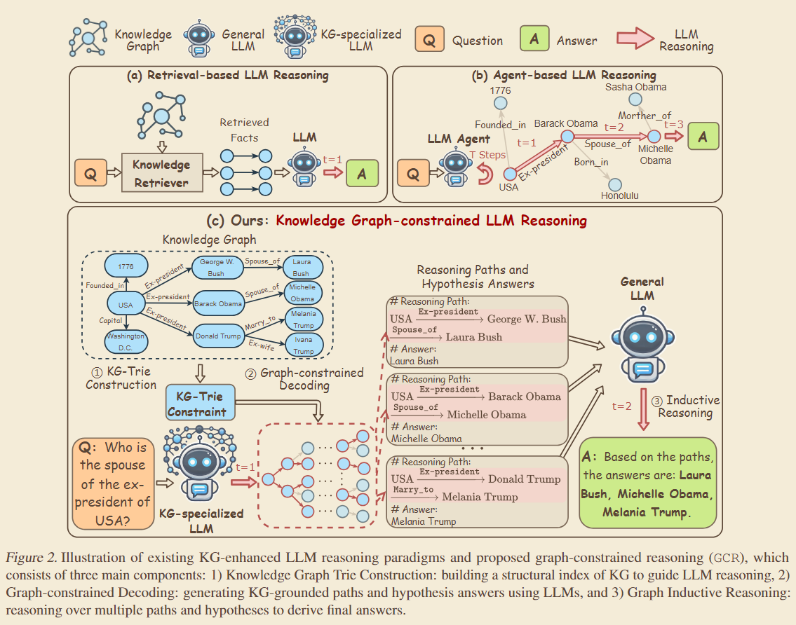
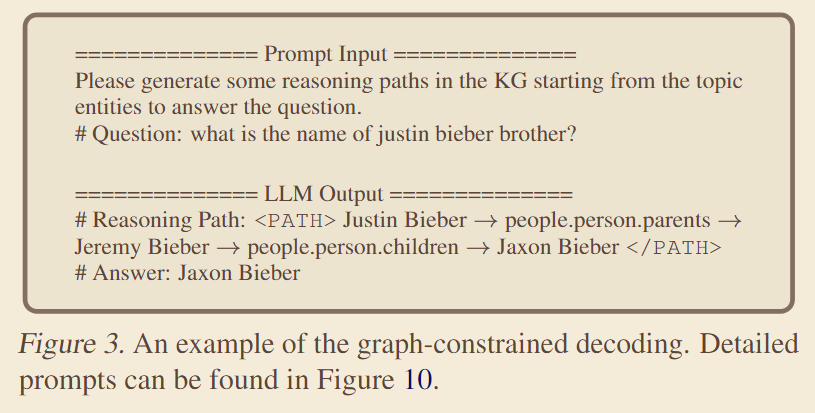
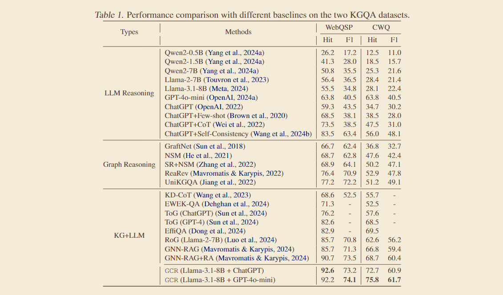
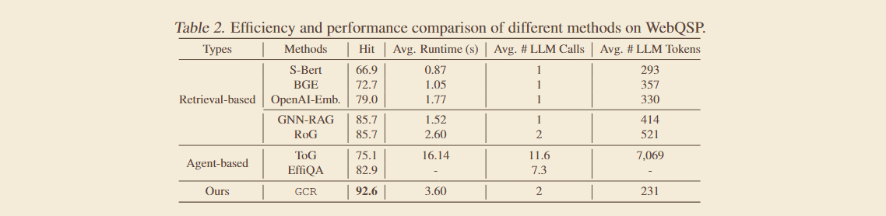
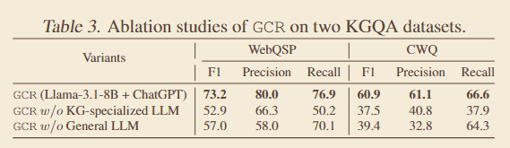
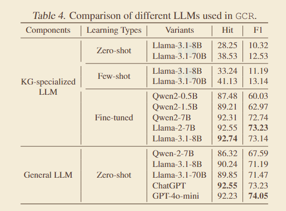
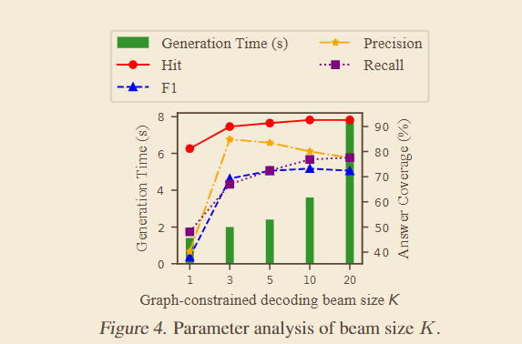
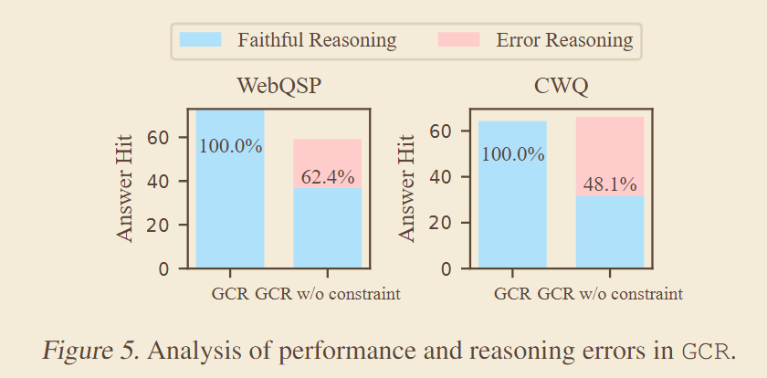
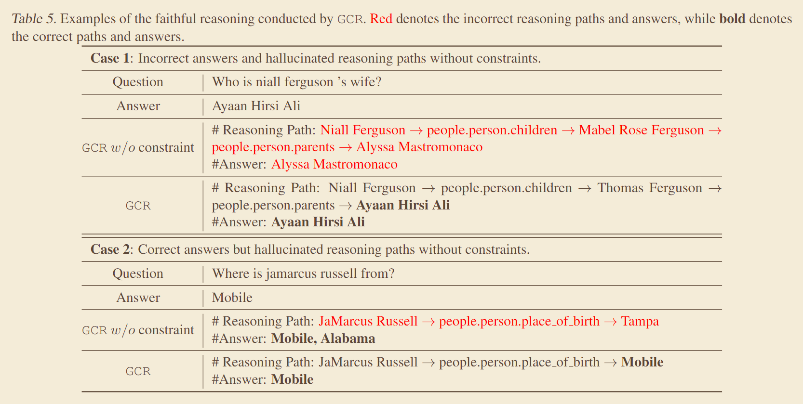
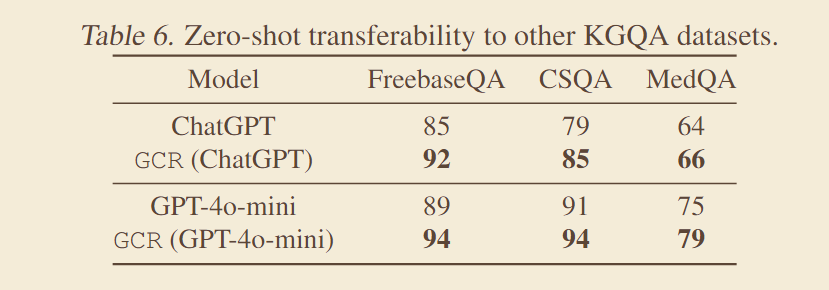

# 图约束推理（Graph-constrained Reasoning）：将知识图谱结构融入 LLM 解码实现零幻觉推理

本文提出了一种名为图约束推理（Graph-constrained Reasoning, GCR）的新型框架，旨在解决大型语言模型（LLMs）在知识图谱（KGs）上进行推理时面临的知识鸿沟和幻觉问题。GCR 通过将知识图谱的结构整合到 LLM 的解码过程中，确保了忠实于 KG 的推理，并消除了推理幻觉。该框架结合了轻量级 KG 专用 LLM（用于图约束推理）和强大的通用 LLM（用于对多条推理路径进行归纳推理），从而实现了零幻觉的准确推理。

## 研究背景与动机

LLMs 在 KGs 上进行推理时面临知识鸿沟和幻觉问题——即使 LLM 能给出正确答案，缺乏 KG 约束也可能导致推理路径的幻觉。现有的KG增强LLM推理方法（如检索式和代理式）要么依赖于精确的外部检索器，泛化能力差，要么计算成本高，延迟大，且都未能有效解决幻觉问题。为了消除LLM在KG推理中的幻觉，并确保推理的忠实性，作者提出了一种新的范式，将LLM的非结构化推理与KG的结构化知识相结合。下图对比了现有的 KG 增强 LLM 推理范式（检索式和代理式）与本文提出的 GCR 框架。

## 核心方法

GCR 框架在宏观上结合了轻量级 KG 专用 LLM（用于图约束解码）和强大的通用 LLM（用于对多条推理路径进行归纳推理），连接了LLM的非结构化推理与KG的结构化知识，以消除推理幻觉并确保忠实推理。上图中，GCR 由三个核心组件构成：知识图谱 Trie 构建、图约束解码和图归纳推理。

**链式思考（CoT）**。在此之前，需要理解链式思考（CoT）推理的数学形式及其如何扩展到 KG 场景。标准 CoT 将推理过程分解为多个中间步骤，通过对所有可能的推理步骤求和来计算答案概率：

$$
P(a|q) = \sum_z P_\theta(a|z,q)P_\theta(z|q)
$$

给定问题 $q$ 时答案 $a$ 的概率通过对所有可能的推理步骤 $z$ 求和来计算。其中 $P_\theta(a|z,q)$ 是在给定推理步骤和问题下得到答案的概率，$P_\theta(z|q)$ 是在给定问题下产生推理步骤的概率。

当引入知识图谱后，推理步骤 $z$ 被替换为 KG 中的推理路径 $\mathbf{w}_{\mathbf{z}}$，从而扩展了 CoT：

$$
P(a|q,\mathcal{G}) = \sum_{\mathbf{w}_{\mathbf{z}}} P_{\phi}(a|q,\mathbf{w}_{\mathbf{z}})P_{\phi}(\mathbf{w}_{\mathbf{z}}|q,\mathcal{G})
$$

该公式表明 KG 增强推理旨在找到连接问题实体和答案的 KG 推理路径 $\mathbf{w}_{\mathbf{z}}$。

**知识图谱 Trie 构建（Knowledge Graph Trie Construction）。** 将 KG 转换为结构化索引 KG-Trie，以促进 LLM 在 KG 上的高效推理。给定 KG 和问题，首先从问题中提及的实体出发，通过广度优先搜索在 L 跳内检索推理路径集合：

$$
\mathcal{W}_{\mathbf{z}}=\operatorname{BFS}(\mathcal{G},\mathcal{E}_{q},L)
$$

从知识图谱 $\mathcal{G}$ 中以问题实体 $\mathcal{E}_{q}$ 为起点，在 $L$ 跳内检索推理路径集合。

将检索到的路径格式化为句子，然后由LLM的分词器分割成 token 序列：

$$
\mathcal{T}_{z}=\operatorname{Tokenizer}(\mathcal{W}_{z})
$$

将推理路径集合转换为 token 序列集合。

最后将 token 序列存储为 Trie 结构，作为约束来指导LLM的解码过程：

$$
\mathcal{C}_{\mathcal{G}}=\mathrm{Trie}(\mathcal{T}_{\mathcal{Z}})
$$

该 KG-Trie 将作为约束指导 LLM 解码，确保生成的 token 始终是有效路径前缀。

**图约束解码（Graph-constrained Decoding）。** 统一LLM的推理能力与KG的结构化知识，生成忠实于KG的推理路径，消除幻觉。设计指令提示，引导LLM生成推理路径和假设答案，采用 KG-Trie 作为约束，指导LLM的解码过程，确保只生成在KG中有效的推理路径。下图展示了一个具体示例，对于问题"Justin Bieber 的兄弟叫什么名字？"，LLM 生成了从 Justin Bieber 到 Jaxon Bieber 的推理路径。

在数学上，GCR 将标准解码过程分解为常规解码，并通过引入约束进行修正：

$$
P_{\phi}(a,\boldsymbol{w}_{z}|q)=\overbrace{P_{\phi}(a|q,\boldsymbol{w}_{z})}^{\mathrm{Regular\ decoding}}
$$

GCR 通过引入 KG-Trie 约束来修改此解码过程，确保路径忠实于 KG。

约束函数是图约束解码的核心，它检查当前生成的 token 是否是 KG-Trie 中任何推理路径的有效前缀：

$$
\mathcal{C}_{\mathcal{G}}(w_{z_{i}}|w_{z_{1:i-1}})=1
$$

如果前缀有效则返回 1，否则返回 0。这是图约束解码的核心约束函数，检查生成的 token 是否是 KG-Trie 中任何推理路径的有效前缀，从而防止幻觉。

微调一个轻量级的KG专用LLM（例如Llama-3-8B）来执行图约束解码任务。其训练损失函数为：

$$
\mathcal{L}=\mathbb{E}_{(q,\mathbf{w}_{\mathbf{z}},a)\sim\mathcal{D}_{\mathcal{G}}}\operatorname{log}P_{\phi}(a,\mathbf{w}_{\mathbf{z}}|q)
$$

该损失最大化在给定问题下真实答案和推理路径的联合对数概率。

**图归纳推理（Graph Inductive Reasoning）。** 将 KG 专用 LLM 生成的多个推理路径和假设答案输入到一个通用 LLM 中，利用其归纳推理能力来产生最终答案。利用图约束解码，通过束搜索（beam-search）在一次LLM调用中同时生成 K 个推理路径和假设答案集合：

$$
\mathcal{Z}_{K}=\{a^{k},\mathbf{w}_{\mathbf{z}}^{k}\}_{k=1}^{K}=\operatorname{arg}\,\operatorname{top-}K\,P_{\phi}(a,\mathbf{w}_{\mathbf{z}}|q)
$$

通过束搜索生成 Top-K 个推理路径和假设答案，为图归纳推理提供输入。

将 $\mathcal{Z}_{K}$ 输入到一个强大的通用LLM（例如ChatGPT或GPT-4o-mini）中，综合各路径证据得出最终答案：

$$
P_{\theta}(\mathcal{A}|q,\mathcal{Z}_{K})\simeq\prod_{k=1}^{K}P_{\theta}(\mathcal{A}|q,a^{k},\mathbf{w}_{z}^{k})
$$

通用 LLM 结合多个推理路径和假设答案来得出最终答案，从而提高准确性。

## 实验与结果

### 实验设置
**数据集。**
- KGQA 基准测试：WebQuestionSP (WebQSP) 和 Complex WebQuestions (CWQ)，均以 Freebase 作为知识图谱。
- 零样本泛化数据集：FreebaseQA（Freebase）、CSQA（ConceptNet）和 MedQA（医学KG）。
- 微调数据集：基于 WebQSP 和 CWQ 的训练集生成问题-推理路径-答案三元组。

**基线方法。** 
- LLM 推理方法（Qwen2, Llama, ChatGPT, GPT-4o-mini, CoT, Self-Consistency）
- 图推理方法（GraftNet, NSM, ReaRev）
- KG 增强 LLM 推理方法（KD-CoT, RoG, GNN-RAG, ToG, EffiQA）。

**评估指标。** 
- WebQSP 和 CWQ 使用 Hit 和 F1
- CSQA 和 MedQA 使用准确率。

**GCR 实现细节。** KG-Trie 索引 2 跳内的推理路径，KG 专用 LLM 使用微调的 Llama-3-8B，生成 Top-10 推理路径和假设答案，通用 LLM 使用 ChatGPT 和 GPT-4o-mini。

### 主要结果
GCR 在 WebQSP 和 CWQ 数据集上均达到最佳性能，Hit 指标分别比次优方法高出 2.1% 和 9.1%。GCR 实现了 100% 的忠实推理率，有效消除了推理幻觉。表 1 展示了 GCR 与 LLM 推理方法、图推理方法、KG+LLM 方法在 WebQSP 和 CWQ 上的性能对比，GCR 在 Hit 和 F1 指标上均达到 SOTA 性能。

表 2 对比了 GCR 与检索式和代理式方法在 WebQSP 上的运行时间和 LLM 调用次数，GCR 在合理的时间和调用次数下实现了最佳性能，KG-Trie 的并行计算优势显著降低了计算成本和延迟。

GCR 在 FreebaseQA 和 CSQA 数据集上，零样本性能分别比 ChatGPT 和 GPT-4o-mini 提高了 8.2% 和 7.6% 的准确率，展现出强大的泛化能力。

### 消融研究与参数分析
**组件有效性。** 表 3 展示了移除 KG 专用 LLM 或通用 LLM 任一组件都会导致性能显著下降，证明两者对 GCR 性能的重要性。

**不同 LLM 分析。** 表 4 比较了不同 KG 专用 LLM（微调/零样本/少样本）和通用 LLM 的性能。微调后的轻量级 LLM（0.5B）性能可超越大型 LLM（70B），说明微调对 KG 推理的有效性；大型 LLM 在通用和 KG 专用角色中表现更优，强调了模型容量的重要性。

**束搜索大小 K。** 图 4 分析了束搜索大小 K 对 GCR 性能的影响。F1 在 K=10 时达到峰值，平衡了探索和利用；K 过大时搜索空间复杂度增加引入噪声。时间成本从 K=1 的 1.4s 增加到 K=20 的 7.8s，因此实验中设 K=10。

**路径跳数 L。** 表 5 分析了 GCR 在不同路径跳数 L 下的性能。GCR 在两个数据集上均实现 100% 忠实推理率；移除 KG 约束后准确率和忠实推理率显著下降，说明 KG 约束不仅缩小搜索空间以提高推理能力，还在防止幻觉方面起关键作用。

**案例研究。** 表 6 通过案例研究对比了有无约束时 LLM 生成路径和答案的正确性，展示了 GCR 在消除幻觉方面的有效性。

**零样本泛化。** 表 7 展示了 GCR 在 FreebaseQA、CSQA 和 MedQA 等未见过的 KGQA 数据集上的零样本泛化能力，GCR 显著优于 ChatGPT 和 GPT-4o-mini。

