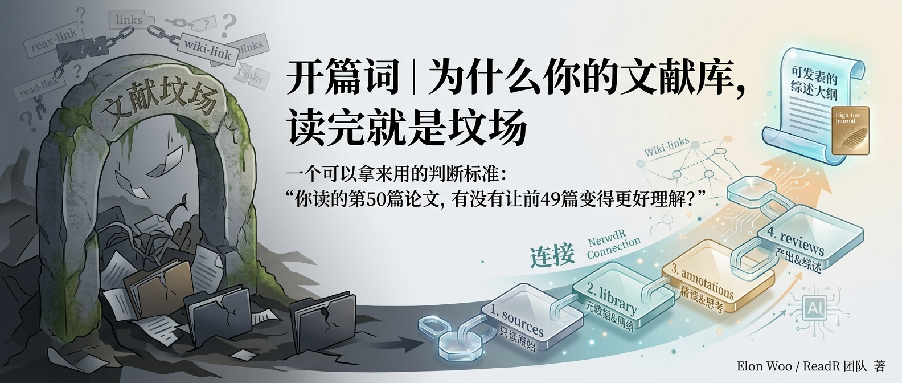

## 你将获得

- 一套判断"文献管理工具是否有效"的具体标准，而不是"好不好用"这种模糊感受
- 三种主流方案（Notion、Zotero、纯 Markdown）失效的技术原因，而非使用体验吐槽
- 这个专栏接下来六讲要解决的具体问题清单

## 一个每个科研人都熟悉的场景

下载一篇 PDF，丢进文件夹，读完关掉。三个月后再刷到同一篇论文的引用，你打开文件夹翻半天，找到它，却想不起来自己读过——更想不起来当时觉得它哪里好、哪里有问题、和你正在做的方向有什么关系。

这不是懒。这是几乎所有文献管理工具共同的结构性缺陷：**它们只解决了"存"，没解决"连"。**

## 三种方案，三种失效方式

先把常见选择摆出来，逐个看它们卡在哪一步。

**Notion**：结构完全自由，你可以建任意字段、任意视图。但正因为自由，它不会替你做任何约束——今天用一套标签体系，三个月后换了个研究方向，标签体系跟着漂移，旧笔记和新笔记之间不再兼容。自由度换来的是维护成本，而这个成本大多数人撑不过半年。

**Zotero**：标注功能扎实，PDF 高亮、批注、条目管理都成熟。但它的知识组织单元是"文献条目"，你的理解、你的批判性思考，活在另一个系统里——要么是 Word 里的读书笔记，要么是脑子里。标注和知识体系是两张皮，从 Zotero 打开一篇论文，看不到你上次读到一半时想到的、和另一篇论文的关联。

**纯 Markdown 文件夹**：足够轻量，也足够灵活，写起来没有任何门槛。问题是没有任何连接机制——每篇笔记都是孤岛，写了一百篇和写了十篇，检索效率没有本质差别，因为知识没有在"生长"，只是在"堆积"。

三种工具，三种失效路径：自由到没有约束、标注和思考分离、有内容没有连接。表面上是工具选型问题，本质上是同一件事没做对：**没有把"读一篇论文"和"积累一套知识体系"设计成同一个动作的两个结果。**

## 一个可以拿来用的判断标准

抛开"好不好用"这种感受化的评价，给文献管理方案一个具体的检验标准：

> 你读的第 50 篇论文，有没有让前 49 篇变得更好理解？

如果答案是"没有，第 50 篇只是文件夹里多了一个文件"，那这套工具在做的事情叫存档，不叫知识管理。真正有效的知识管理系统，应该让每一次新的阅读，都反过来加深你对已有内容的理解——新论文提到一个你见过的概念，应该能立刻找到之前所有相关的笔记；新论文用了一个你已经吐槽过的方法，应该能自动接续上你之前的判断。

这个标准背后是一个更根本的分野，也是这个专栏接下来要反复回到的分野：**知识合成发生在什么时候。**

多数人的习惯是"查询时"才整理——写综述前才回头把读过的论文捋一遍，这时候大部分细节已经忘了，只能重新翻一遍原文。另一种可能是"摄入时"就整理——读的当下就把新知识和旧知识连起来，等真正要写东西的时候，连接已经提前做好了，你要做的只是取用。前者是每次现算，后者是持续复利。

## 这个专栏要解决什么

接下来六讲，会围绕一个具体的实践载体展开——[ReadR](https://github.com/elonwoo-02/ReadR)，一套面向科研人员的四层文献知识库架构（`sources → library → annotations → reviews`），思路上受 Karpathy 的 LLM Wiki 启发，但做了一个关键的反转：**AI 不是知识的作者，人才是。**

具体会讲：

- **01｜四层架构**：为什么要把"只读原始资料""人工策展目录""精读笔记""综述产出"严格分层，每一层的读写权限怎么设计
- **02｜元数据设计**：YAML frontmatter 和 wiki-link 怎么把孤立的论文笔记连成一张可查询的网络
- **03｜人机分工**：AI 能在哪些环节自动化，哪些环节必须由人完成——以及为什么这条边界不能模糊
- **04｜知识沉淀的最小动作**：从"浏览"到"精读"，具体每一步要做什么，怎么避免"读完再统一整理"这种几乎必然失败的模式
- **05｜工具化**：把手工流程封装成可复用的 Agent/Skill，自动化的边界在哪
- **06｜实战复盘**：一个真实的科研方向，怎么用这套方法论从零散阅读走到一份可发表的综述大纲

如果你现在的文献库也处于"读完就是坟场"的状态，下一讲从最容易被忽视的地方开始——不是选工具，而是先搞清楚，你的知识库里，哪些内容应该被锁死、不能变。

---

**思考题**：翻一下你现在的文献管理工具，找出最近读的三篇论文。你能在一分钟内说清楚它们之间的关系吗？如果不能，问题出在"存储"还是"连接"？