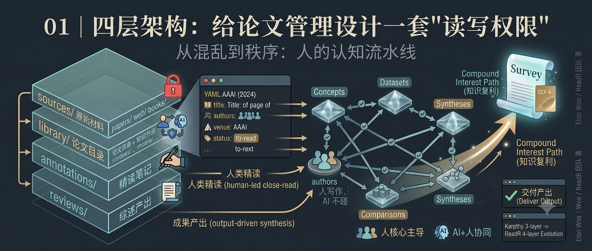

## 你将获得

- 一套可以直接套用的四层目录结构：`sources → library → annotations → reviews`
- 判断"某类内容该放哪一层"的三条权限规则，不靠感觉，靠归属
- 一个反例：看不分层的系统具体死在哪一步

## 从一个反例说起

先说一个很多人干过的事：在存 PDF 的文件夹里，直接给 PDF 加高亮、加批注，有时候顺手还改个文件名，"这篇重要"改成 `MASTER_重要_final.pdf`。

当下很方便。半年后会发生什么？

你重新打开这个文件夹，看到三份长得几乎一样的 PDF——一份是投稿版，一份是 camera-ready，还有一份你自己也说不清是哪来的。当时高亮的那段话标在哪一页？引用的页码对着哪个版本？那个"重要"是谁标的、为什么标的？全都不可追溯了。你想引用一个数字，得先花十分钟确认自己手里这份到底是不是原始版本。

这不是整理习惯问题，这是权限设计问题：**你把"不可变的原始材料"和"持续演化的个人理解"放在了同一个可写空间里。** 大多数文献系统的混乱，起点都在这里——不是工具不够好，是"什么能改、什么不能改"这条线从一开始就没画。

ReadR 的四层架构，本质就是把这条线画出来，并且画四次。

## 四条权限规则，四层目录

先给结构，再逐层讲为什么。

```
┌──────────────────────────────────────────────────────────┐
│  sources/      library/       annotations/     reviews/  │
│  原始材料       论文目录         精读笔记          综述产出   │
│  （只读）       + 知识节点                            │
│                                                          │
│   immutable     你策展          你精读            你写作    │
└──────────────────────────────────────────────────────────┘
```

贯穿四层的权限规则只有三条：

1. **原始材料，谁都不能改**——AI 不能改，人也不能改，包括你自己
2. **结构化知识，AI 起草，人确认**——AI 可以提取、可以建议，落盘前人过目
3. **判断与产出，只能人写**——精读的评价、综述的论点，AI 不碰

带着这三条规则，逐层看。

### 第一层：`sources/` —— 只读的地面真相

所有原始材料：论文 PDF、网页剪藏、书摘、讲座笔记，按 `papers/ web/ books/ talks/ misc/` 分类存放。规则只有一条：**进来之后就不再变。**

为什么值得专门隔离一层？因为它是你整个知识库里唯一可以无条件信任的部分。三个月后你怀疑某条笔记记错了、怀疑 AI 提取的概念有偏差，能回来对答案的只有这里。软件工程里管这个叫 ground truth；只要它可能被随手改动，上面所有层级的可信度都会跟着塌。

反过来说，这一层也故意"什么都不做"：不做标注、不做摘要、不做标签。那些活属于上面几层，各有各的地方。

### 第二层：`library/` —— 人工策展的目录和知识节点

这是整个系统里活动最多的一层，分两块。

**`entries/`：一文一档。** 每篇论文对应一个 markdown 文件，YAML frontmatter 承载结构化元数据——标题、作者、会议、DOI、评分、阅读状态，以及指向精读笔记和各类知识节点的链接字段。文件按研究方向分目录组织。这一层回答的问题是："这篇论文是什么、在我的版图里处于什么位置。"

**`concepts/ authors/ datasets/ benchmarks/ comparisons/ syntheses/ projects/`：知识节点。** 这是浏览论文时"顺手沉淀"下来的东西：遇到一个新概念就建一条概念档，遇到一个可比方法就开一行对比表，同方向攒够三篇就写一篇综合概述。它们不是论文的附属品，而是独立于任何单篇论文存在的、可复用的知识资产。

权限规则：AI 辅助生成，人最终确认。概念提取、对比表初稿这类机械活可以交给 AI（第三讲会细讲边界），但字段怎么填、链接连不连，决定权在人。

### 第三层：`annotations/` —— 只对精读开放的笔记层

精读笔记单独成层，而且设了准入门槛：**只有 `status: close-read` 的论文才有资格在这里建文件夹。** 浏览阶段的心得写在 entry 正文里就够了，不配进入这一层。

为什么要把精读和目录分开？因为两者的更新频率和作者身份完全不同。entry 是档案，建完基本不动；精读笔记是深度的、个人化的理解，会随着你认知加深而反复修改。分开之后，目录层保持整洁稳定，精读层可以自由生长。两者通过 entry 里的 `annotation:` 字段建立单向引用——从目录能跳到笔记，笔记不反向污染目录。

权限规则：AI 可以按模板起草初稿（图表公式穿插在对应小节），但"个人评价与思考"部分必须人写。这条线为什么这么画，是第三讲的主题。

### 第四层：`reviews/` —— 以综述为终点的产出层

最后一层是产出：正式的综述论文，支持 md / pdf / tex / bib 多格式。

很多知识管理系统没有这一层——wiki 本身就是终点。但对科研人来说，读论文的终点从来不是"拥有一个知识库"，而是写出一篇能投出去的综述或开题报告。这一层的存在会反向约束下面三层的质量：你在 `library/` 里沉淀概念和对比表时，心里清楚这些东西最终要被综述直接取用，就不会用"反正以后再说"的标准来敷衍。

权限规则最严格：人写作，AI 不碰。AI 可以给模板和结构建议，论点、分析、结论全是你的。

### SCHEMA LAYER：给 AI 的契约，不是第五层内容

如果你看过新版 README 的架构图，会发现四层目录上方还有一条独立的横条：「**SCHEMA LAYER** — `CLAUDE.md` — operating rules, naming, workflow」。它不是第五层目录，而是一条与内容四层不同维度的约束层。

区别在于回答的问题不同：

- `sources / library / annotations / reviews` 四层回答的是 **"东西该放哪"**——PDF 放 sources/, 概念定义放 library/concepts/，精读笔记放 annotations/，综述放 reviews/。它们分层管理的对象是**内容**。
- SCHEMA LAYER 回答的是 **"AI 该怎么做"**——哪些文件不能碰、命名必须遵守什么格式、工作流的四个阶段各对应什么操作规则。它约束的是**行为**。

两者不在同一个维度。如果不刻意说明，很容易把 SCHEMA LAYER 误解成"又加了一层目录"——实际上它更像一份合同，由 `CLAUDE.md` 承载，每次 AI 被唤醒时自动加载，不需要人每次口头交代一遍。项目根目录下的 `CLAUDE.md` 就是这份合同的具体文本。

一句话定位：**SCHEMA LAYER 管的是"规则"，内容四层管的是"数据"。** 后面第三讲讨论人机分工时会多次回到这份契约，它的存在是"AI 行为可预期"的前提。

## 从三层到四层：多出来的两层解决了什么

这套架构不是凭空设计的，它直接演进自 Karpathy 的 LLM Wiki 三层方案。讲清楚多出来的两层各自补上了什么缺口，四层结构的理由就完整了。

Karpathy 的原始方案是 `raw/ → wiki/ → schema/`：raw 存不可变的原始资料，wiki 是由 AI 代理维护的知识图谱，schema（一个 CLAUDE.md 文件）规定 AI 的行为规则。这个架构里，**AI 是知识的主要作者**，人的角色是策源、浏览和抽查。对"快速覆盖大量文档"这个目标，它近乎完美。

但学术研究有两个硬需求，三层架构接不住：

**缺口一：精读层缺失。** wiki 页面由 AI 摘要生成，知识深度天然停留在摘要层面。可论文的核心价值恰恰藏在摘要之外——公式第 3 步的那个近似假设、消融实验里那个只提升 0.4% 但揭示了机制的对照组。机器摘要替代不了逐行读公式、逐个看消融，这类理解必须有独立的存放层，这就是 `annotations/`。

**缺口二：输出层缺失。** wiki 是终点，意味着知识管理做完就结束了。但科研的终点是产出。没有 `reviews/` 这一层，"读论文"和"写综述"仍然是断裂的两件事——开篇词里说的"查询时才整理"的现算模式，会原封不动地回来。

对照表如下（按维度压缩了三个系统的差异）：

| 维度 | Karpathy 三层 | ReadR 四层 |
|---|---|---|
| 架构层级 | raw / wiki / schema | sources / library / annotations / reviews |
| 知识作者 | AI 代理主导 | 人类研究者主导 |
| 元数据 | 基础文件元数据 | 学术元数据（DOI/作者/评分/阅读状态） |
| 阅读模型 | 无 | to-read / browsed / close-read 三段式 |
| 精读支持 | 无 | 独立 annotations 层 |
| 输出目标 | 可浏览的 wiki | 可发表的综述 |

一句话概括这个演进：**三层架构把知识管理做成了"AI 的编译产物"，四层架构把它改回了"人的认知流水线"，AI 从作者降回助手。**

## 小结

四层结构用一句话记：**分层的本质不是目录整洁，是给"人"和"AI"划出清晰的责任边界。** `sources/` 锁住事实，`library/` 沉淀结构，`annotations/` 承载理解，`reviews/` 交付产出。每一层都有自己的读写权限，跨层的唯一通道是 wiki-link——这正是下一讲的主题：这些层级之间靠什么连成一张网，而不是四个互相看不见的抽屉。

---

**思考题**：打开你现在的文献文件夹，试着把里面的东西按四层重新归类。注意数一数：有多少内容其实是混着放的——标注写在 PDF 里、笔记和 PDF 挤在同一层、"以后要写的那篇综述"根本没有自己的位置？