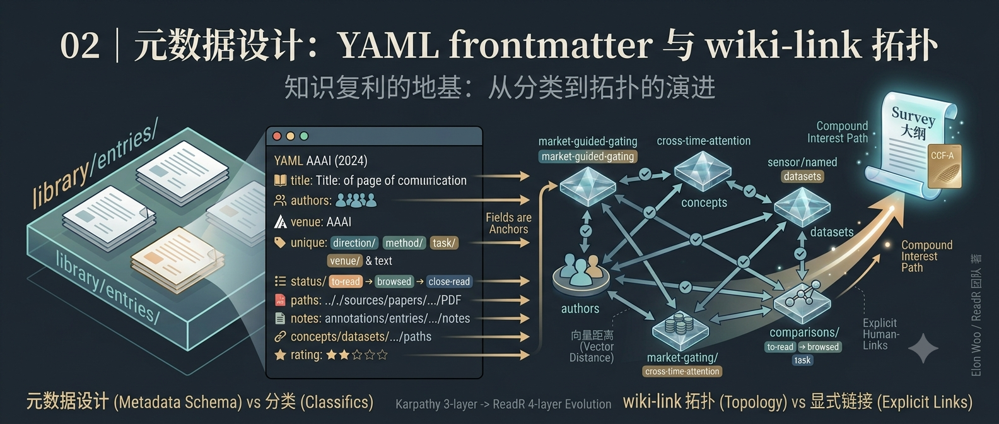

## 你将获得

- 一份可复用的 YAML 字段清单，以及每个字段背后的设计动机，不是照抄模板
- 三段式阅读状态模型（to-read/browsed/close-read）替代布尔值的理由
- 现场演示：为 KG+LLM+Agent 方向设计一套 tag 体系

## 从一个反例说起

还是先说一个常见场景：你在论文笔记里随手打标签，`transformer`、`Transformer`、`self-attention`、`注意力机制`——同一个概念，四种写法散落在不同笔记里。半年后你想找"所有跟自注意力有关的论文"，搜索框输入哪个词都只能捞到四分之一。

这不是打字不小心。是标签这件事一旦没有 schema，就必然会漂移——今天心情好写英文，明天嫌麻烦写中文，下个月换了个说法。自由标签的问题和上一讲提到的 Notion 一模一样：自由度换来的是维护成本，而维护成本会在你没意识到的时候，悄悄吃掉检索能力。

`library/entries/` 里的 YAML frontmatter，就是把这条"自由"提前锁死的地方。它不是给论文归档用的装饰性元数据，是整个知识库能不能被检索、能不能被关联的地基。

## 逐字段拆解：每个字段解决什么问题

先看一份完整的 entry frontmatter：

```yaml
---
title: "MASTER: Market-Guided Stock Transformer for Stock Price Forecasting"
authors:
  - Li, Tong
venue: "AAAI (2024)"
tags:
  - direction/kg-llm
  - method/transformer
  - task/stock-prediction
  - status/close-read
  - venue/aaai
pdf: ../../sources/papers/master-aaai2024.pdf
doi: 10.1609/aaai.v38i1.27767
rating: ⭐⭐⭐⭐
annotation: annotations/entries/kg-llm/master-aaai-2024/
concepts: [market-guided-gating, cross-time-attention]
authors_related: []
datasets: [csi300, csi800]
benchmarks: [ic, rank-ic]
---
```

逐个看，每个字段回答的是什么问题。

**title / authors / venue / doi：这篇论文"是什么"。** 看起来是最基础的元数据，但比"文件名"可靠得多——文件名会被你随手改成 `重要_final`，这几个字段不会。DOI 尤其关键：它是唯一能在多年后帮你精确定位到原文、且不依赖你记忆的锚点。

**tags：用 category/key 的写法，不是自由词。** 这是解决开头那个漂移问题的地方。`direction/kg-llm`、`method/transformer`、`task/stock-prediction`——前缀固定了分类维度，后面的 key 才是变量。好处很直接：你搜 `direction/` 前缀，能看到自己目前有哪些研究方向在跑；搜 `method/transformer`，不会因为有人写了 `Transformer` 大写就漏掉一半结果。分类维度本身也不是随便定的，通常是 direction（大方向）、method（方法）、task（任务）、status（阅读状态）、venue（发表渠道）这五类，各管一件事，互不重叠。

**status：为什么是三段式，不是"读过/没读过"。** `to-read → browsed → close-read`。如果只有布尔值，你没法区分"我扫了一眼摘要"和"我逐行读完了公式推导"——但这两种状态对应完全不同的 AI 介入深度（上一讲提过，第三讲会细讲）。三段式本质上是在给"我对这篇论文的理解深度"打了一个可查询的刻度，而不只是记录"碰过没碰过"。

**annotation / concepts / authors_related / datasets / benchmarks：这些不是元数据，是链接。** 它们指向的是 `library/` 里其他知识节点的路径或 ID。这几个字段是下一节要讲的 wiki-link 拓扑的锚点——没有它们，四层结构里的 `annotations/`、`concepts/` 等等就是互相看不见的抽屉，接不起来。

你可能注意到了，`authors/`、`datasets/`、`benchmarks/` 是分开的三个目录，而不是合并成一个 `entities/`。这个设计取舍不是随意的——对比项目中参考的 llm-wiki 方案就能看明白。llm-wiki 使用统一的 `entities/` 文件夹装人、组织、产品，因为在通用知识管理场景里，这三种实体的查询维度足够相近，放在一起反而方便。但学术研究场景不同：研究者（按姓名、机构、研究方向查）、数据集（按领域、规模、任务类型查）、基准（按指标、排行榜查）是三套完全不同的查询维度，混在一个文件夹里要么让索引规则变得复杂，要么检索效率打折扣。分开成 `authors/`、`datasets/`、`benchmarks/`，每种实体目录内部可以有自己的命名规范和字段结构，查询路径清晰，不会互相干扰。

**rating：量化的是你的判断，不是论文的客观质量。** ⭐⭐⭐⭐ 记录的是"这篇论文对我当前研究有多大参考价值"，同一篇论文换个研究方向来看，评分完全可以不一样。这个字段存在的意义是让你多年后回头翻的时候，能立刻分辨出"当时觉得重要"和"当时随手扫了一眼"的区别。

## wiki-link 拓扑：字段怎么连成一张网

单看一条 entry 的字段列表还看不出价值，价值在于这些字段把四层结构串起来之后长什么样：

```
library/entries/kg-llm/master-aaai-2024.md
        │
        ├──→ annotations/entries/kg-llm/master-aaai-2024/index.md   （annotation 字段）
        ├──→ library/concepts/market-guided-gating.md               （concepts 字段）
        ├──→ library/concepts/cross-time-attention.md
        ├──→ library/datasets/csi300.md                              （datasets 字段）
        ├──→ library/benchmarks/ic.md                                （benchmarks 字段）
        └──→ library/comparisons/stock-transformer-methods.md        （手动关联）
```

一篇论文条目往外辐射出五六条链接，指向不同类型的知识节点。这些节点本身也会被其他论文条目引用——比如 `cross-time-attention` 这个概念节点，可能同时被 MASTER 和另外两篇论文的 entry 链接。攒到第三篇涉及同一概念的论文时，就该去 `library/comparisons/` 开一张对比表，把这几篇论文在这个概念上的处理方式并排摆出来。

这套拓扑和 RAG 检索的本质区别在于关联的来源。RAG 靠嵌入相似度找关联：两段文本在向量空间里离得近，就被认为相关。这里有个真实的坑——两篇论文可能讨论同一个概念但用词完全不同（比如一篇叫"自注意力"，另一篇叫"scaled dot-product attention"的某个变种），嵌入检索容易把它们判定为不够相似而漏掉；反过来，两篇论文可能只是碰巧用了相似的表述,却在讨论完全不同的东西，嵌入检索又容易误判为相关。

wiki-link 是显式关联：`concepts: [cross-time-attention]` 这行字是你自己（或 AI 辅助你）读完论文之后判断"这篇确实用到了这个概念"才写上去的。你清楚地知道两篇论文为什么被连在一起——不是"向量距离近"，是"我读过，我确认过"。可解释、可审计、可以事后推翻重连。

## 现场演示：给 KG+LLM+Agent 方向设计一套 tag 体系

回到具体操作。假设你在跑 LLM-KG 融合、Agent-KG 系统这两个子方向，direction 层的标签该怎么定？

先想清楚一个问题：**tag 的颗粒度该多细？** 太粗，比如只打一个 `direction/ai`，起不到区分作用——你所有论文都挂着同一个标签，等于没打。太细，比如给每篇论文单独发明一个 direction，维护成本会失控，而且没人会记得自己造过多少个标签。

一个可行的分法：

```yaml
tags:
  - direction/kg-llm          # 顶层方向：LLM 与知识图谱的融合
  - direction/agent-kg        # 顶层方向：Agent 与知识图谱结合的系统
  - method/graph-transformer  # 具体方法层
  - method/rag
  - task/kg-completion         # 具体任务层：知识图谱补全
  - task/multi-hop-reasoning   # 多跳推理
```

direction 层控制在个位数,对应你实际在跟进的几个大方向；method 和 task 层可以相对细，因为它们的作用是横向切片——你随时可能想问"我读过的论文里，哪些用了 graph transformer？"或者"哪些在做多跳推理？"，这类问题需要更细的颗粒度才能回答准确。

判断一个标签该不该拆细的简单测试：**如果这个标签下的论文超过十篇还看不出内部差异，说明该拆；如果拆出来的新标签下只有一篇论文，说明拆早了。**

## 小结

元数据设计的核心原则只有一条：字段是不是服务于"未来能不能被检索和关联"，而不是"填表填得好不好看"。tags 用 category/key 锁死漂移，status 三段式记录理解深度，link 字段把四层结构真正连成网络而不是四个抽屉。这一讲把"连"的机制讲完了，下一讲回到"AI 在这套体系里到底该做哪些活"——毕竟这些字段谁来填、填多少，直接决定了人机分工的边界在哪。

---

**思考题**：给你正在读的研究方向写一版 tags 体系草案。先列出 direction 层（不超过 5 个），再想清楚 method 和 task 层各需要几个标签才能覆盖你现有的论文——如果某个标签下只有一篇论文，标出来，想想是不是拆早了。