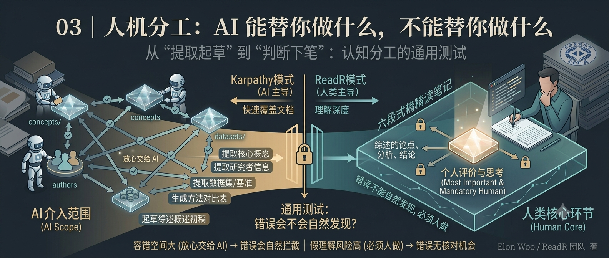

## 你将获得

- 两种人机协作范式的对比框架，以及各自的适用边界
- 一份可以直接对照执行的 AI 介入清单，覆盖 BROWSE / CLOSE-READ / REVIEW 三个阶段
- 一条判断"这件事能不能交给 AI"的通用测试

## 从一个反例说起

设想一个很诱人的操作：把论文 PDF 丢给 AI，让它按精读模板生成一份完整笔记，六个部分全部生成，包括最后"个人评价与思考"那一段——AI 写得挺像样，有理有据，你审一遍，看着没毛病，直接存进 `annotations/`。

三个月后你要写综述，翻出这篇笔记，发现"启发"那一段写的是一句放之四海而皆准的话："该方法为后续研究提供了新的思路"。你完全想不起来自己当时到底是怎么想的——因为你当时根本没想,是 AI 帮你想的。这篇论文在你的知识库里"存在"，但没有真正被你"理解"过。

问题不在于 AI 写得不好，在于这一步的错误——或者更准确地说，"假理解"——不会被任何后续步骤检查出来。你不会因为看到一段通顺的话就去质疑它,直到写综述那一刻才发现空的。这是本讲要讲清楚的核心：**不是所有环节的错误都一样危险，分工的边界应该画在"错误会不会被自然发现"这条线上。**

## 两种范式：AI 是作者，还是人是作者

上一讲提过 Karpathy 的三层架构和 ReadR 四层架构在层级上的差异，这一讲把镜头转到人机协作本身——同样的分层结构下，"谁来写"这件事有两种完全不同的答案。

**Karpathy 模式：AI 代理主导知识编译。** 人的角色被简化成三件事：策源（喂原始资料）、探索（浏览 wiki 提问题）、审核（抽查 AI 生成的内容）。AI 承担摄取、总结、交叉引用、更新维护的全部工作。这套模式的优势非常直接：维护成本趋近于零，AI 可以全天候处理新文档，人不需要持续投入时间。对"快速覆盖大量文档"这个目标，几乎是最优解。

代价也很直接：AI 生成的内容一旦固化进 wiki 页面，错误会比单次查询更隐蔽、更持久。RAG 查询答错了,你当场就能发现、当场重新问；wiki 页面写错了，它会安安静静地待在那里，被下一次查询继续引用，错误像滚雪球一样传下去，直到某次你恰好较真去查原文才被揪出来。

**ReadR 模式：人类策展，AI 辅助。** 用阅读状态模型（to-read/browsed/close-read）给 AI 的介入划出明确的粒度：browsed 阶段可以大规模用 AI，close-read 阶段人必须深度参与。这不是"AI 少做一点活"的妥协，是针对上面那个风险做的结构性防御——把"AI 生成内容一旦出错就很难被发现"这件事，限制在容错空间更大的阶段。

两种范式不是谁更先进，是服务于不同目标：前者追求覆盖速度，后者追求理解深度。科研场景选后者，是因为综述最终要对读者、对审稿人负责，摘要层面的覆盖速度换不来这个责任。

## 一条通用测试：这件事能不能交给 AI？

与其记一份僵化的清单，不如记一个可以自己推演的测试：

> **如果 AI 生成的这部分内容有错，这个错误会不会在你后续的步骤里被自然发现？**

会被发现——放心交给 AI。不会被发现——必须人做。

拿开头的反例过一遍：AI 提取的"概念"如果提错了，你精读的时候会读到原文,自然会发现提取错了，顺手改掉——错误被下一步自然拦截。但"个人评价与思考"如果由 AI 代写，后面没有任何一步是"再读一遍论文核对你的想法对不对"的——这段内容从写下的那一刻起，就没有再被验证的机会,除非你主动怀疑它。这就是为什么同样是"AI 生成的文字"，前者能放手，后者不能。

这条测试比死记清单更有用的地方在于：它能推广到你自己判断任何新场景，而不只是本讲列出的这几项。

## AI 介入清单：三个阶段，逐条对照

把测试应用到 ReadR 的三个工作阶段，落成一份可以直接执行的清单。

**BROWSE 阶段——可以放心交给 AI：**

- 提取论文核心概念 → 写入 `library/concepts/`
- 提取研究者信息 → 写入 `library/authors/`
- 提取数据集 / 评测基准 → 写入 `library/datasets/`、`library/benchmarks/`
- 生成方法对比表 → 写入 `library/comparisons/`
- 攒够三篇同方向论文后，起草 `library/syntheses/` 概述初稿

这些活的共同点：错误都会在你精读原文、或者下次查表使用时被自然拦截，容错空间大。

**CLOSE-READ 阶段——AI 起草，人必须深度介入：**

- 按模板生成笔记初稿，图表和公式按对应小节穿插解释（不是文末汇总）
- **唯一强制人工完成的部分：第六段"个人评价与思考"**——个人理解、启发、疑问、可改进之处，四个子问题都必须是你自己的答案

前五段（基本信息、摘要与核心问题、核心方法、实验与结果、讨论与分析）本质是"转述论文说了什么"，AI 起草之后人过一遍核对即可，错误容易在核对时被发现。第六段是"你自己怎么想"，这件事的定义就是 AI 没法替你做的——AI 没有"你的研究方向"这个上下文，写出来的只能是通用的场面话。

**REVIEW 阶段——AI 只提供脚手架：**

- 模板结构、格式规范、章节骨架，AI 可以给建议
- 论点、分析、结论：完全人工

综述是对外的产出物，是要对读者负责的最终结论，这一层容不下任何"看着没毛病就先放着"的内容。

### 这些分工不是建议，是写进契约的规则

上面这整张清单，在 ReadR 里不只是一份建议性的"AI 使用指南"，而是写进了项目根目录下 `CLAUDE.md` 的硬性行为规则——每次 AI 被唤醒时自动加载，不需要人每次都重新交代一遍。`README` 的「Claude Code Guide → Notes」里明确写了四条红线，直接对应上面的分工边界：

1. **`sources/` 不可修改** — AI 永远不会碰这一层，这是整个知识库可信的底线
2. **所有写入都需要用户确认** — AI 不会未经确认直接落盘，生成的内容在得到明确许可前只是"草稿"
3. **AI 产出永远是草稿** — 概念定义、方法对比、精读笔记都需要人 review，AI 不承担"最终审校"的角色
4. **图表公式必须手工嵌入** — 架构图、消融实验表格、数学符号推导，AI 无法自动处理——这恰好对应 CLOSE-READ 阶段"人必须深度介入"那条边界

这四条红线可以从侧面验证上一节的 AI 介入清单：清单的每一条都有对应的规则兜底。分工边界不是写文章时说说的，是直接编码进了 AI 的行为约束里。如果你在自己的项目里使用其他 AI 工具，同样建议把相应的分工规则写到项目文档（或者工具的 system prompt）里，让规则先于操作存在。

## 为什么"个人评价与思考"不能被压缩

精读笔记的六段式结构，前五段是在"读懂"论文，第六段才是在"消化"论文。读懂是可以被验证的——你能不能复述作者的方法、能不能画出架构图，别人一眼能看出你懂没懂。消化没法用这种方式验证，它的产物是一个可以被质疑、可以被反驳的具体观点：这篇论文的假设在你的场景下站不站得住？如果你是审稿人,会在哪一步追问？

AI 代写这一段最典型的失败模式,就是开头那个反例——写出一句正确但空洞的话,套在任何论文上都成立。这种话看起来是"评价"，其实只是摘要的同义转述，没有提出任何可以被反驳的具体主张。而"消化"这件事的定义,就是必须发生在一个具体的人、具体的研究阶段、具体的知识背景里——这恰恰是 AI 缺失的上下文。

## 小结

分工原则一句话：**AI 负责"提取"和"起草"，人负责"判断"和"下笔"。** 具体怎么划这条线，用"错误会不会被后续步骤自然发现"这条测试去推演，比死记清单更可靠——它能帮你判断清单之外没列到的新场景。下一讲把镜头拉回到最日常的动作：浏览一篇论文的当下，具体要做哪几件事，才能让"沉淀"这件事真正发生，而不是停留在这一讲说的原则层面。

---

**思考题**：回想你最近一次用 AI 辅助读论文的经历,把用到的每一步动作对照上面的清单过一遍。有没有哪一步——尤其是"总结这篇论文对我的启发"这类问题——其实是你本该自己回答、却让 AI 代劳了的？