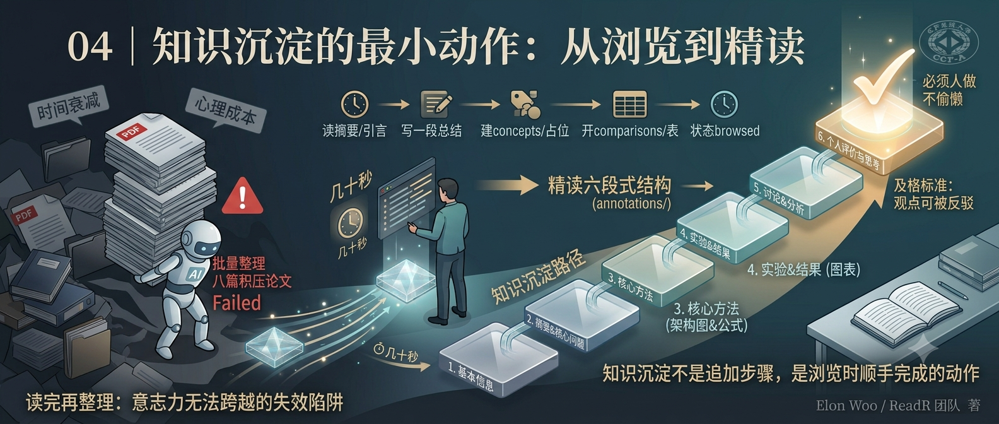

## 你将获得

- 一套"读一篇论文"时可以边读边做的最小动作清单
- 精读笔记六段式结构的分段写作方法，尤其是最容易偷懒的第六段
- "读完再统一整理"为什么几乎必然失败的具体原因

## 从一个反模式说起

周五下班前，你决定把这周攒的八篇论文一次性整理掉。打开第一篇,发现自己完全想不起来读的时候在想什么，只记得"好像有点意思"；打开第三篇，标题都要重新扫一遍摘要才想起来讲的是什么；到第六篇,你开始复制粘贴摘要凑数,告诉自己"下周有空再补细节"。

这周的八篇论文，最后大概率变成八条几乎等价于"读过"的记录，没有一条真正沉淀下来。

这不是意志力问题，是这套流程从设计上就注定失败的两个原因：

**时间衰减**：读完论文的当下，细节最清晰——为什么这个方法有意思、跟你上周读的另一篇有什么关联，这些判断此刻在脑子里是鲜活的。拖到周五，这些判断已经从"理解"退化成了模糊的"印象"，你能写下来的只剩摘要能提供的那点信息，跟直接复制摘要没有本质区别。

**批量整理的心理成本**：面对八篇积压的论文，人会本能地寻找捷径——这就是上一讲说的"个人评价与思考被压缩成场面话"最常见的触发场景,不是因为你想偷懒，是批量处理时大脑会自动切换到"完成任务"模式,而不是"消化内容"模式。

解法不是意志力更强,是把整理动作提前，绑定到阅读本身，而不是阅读之后的一个独立步骤。

## 浏览阶段的最小动作序列

打开一篇论文，读摘要和引言的过程中，同步做这几件事——不是读完之后做，是读的当下顺手做：

1. **写一段自己的总结**——不是翻译摘要，是用你自己的话概括这篇论文在解决什么问题。翻译和复述之间的差别，就是"读过"和"理解过"的差别。
2. **打标签**——对照上一讲设计的 tags schema，`direction/` `method/` `task/` 各填一个
3. **顺手动作，遇到就做，不攒着**：
   - 遇到一个新概念 → 立刻在 `library/concepts/` 建条目，哪怕只有一行占位
   - 遇到一个可比的方法 → 立刻在 `library/comparisons/` 开一行对比表
   - 同方向的论文攒够三篇 → 触发写 `library/syntheses/` 的动作
4. **更新状态**——`status` 从 `to-read` 改成 `browsed`

关键不在于这几个动作本身有多复杂，而在于"顺手"这两个字。第 3 条那几个动作,单独拎出来看都是几十秒的事——建一行占位、开一行表格。但如果攒到"整理时间"再补，几十秒的事会变成要重新读一遍论文才能补全的事，成本直接翻十倍。

## 精读笔记六段式结构：逐段怎么写

只有 `status: close-read` 的论文才进入这一层。六段式结构不是随便定的顺序，每一段的写法都不一样。

**一、基本信息**——标题、作者、年份、关键词。纯记录，不需要展开，几十秒填完。

**二、摘要与核心问题**——用自己的话概括核心内容和方法（1-2 段），重点落在"研究背景与动机"：作者为什么要做这项研究，现有方法卡在哪，这项研究想填的空白具体是什么。这一段容易写成摘要的翻译腔,提醒自己:是在回答"为什么"，不是在复述"是什么"。

**三、核心方法**——架构图逐模块解释，不是贴一张图完事：图展示了什么、每个模块负责什么、数据怎么流动。公式逐个符号讲清楚含义、推导逻辑、在方法里起的作用。这一段的硬性要求（呼应 CLAUDE.md 里的规则）：**图表公式必须穿插在对应小节里解释，不能堆到文末汇总**——读到"核心方法"这节就该看到架构图和公式，而不是翻到最后才集中甩一堆截图。

**四、实验与结果**——数据集、基线方法、评估指标先交代清楚，再讲主要结果，最后是消融研究。关键图表必须解读，不能只是"如下表所示"这种一笔带过——具体说清楚这张表里哪个数字支撑了哪个结论。

**五、讨论与分析**——主要贡献、创新点总结、优势、局限性（作者自己承认的，加上你认为可能还存在但作者没提的）、未来工作方向。

**六、个人评价与思考——最重要，也最容易偷懒的一段。** 四个子问题：个人理解、启发、疑问、可改进之处。上一讲已经论证过为什么这段不能交给 AI；这里讲具体怎么写才算及格：**判断标准是这段话能不能被反驳。** "该方法为后续研究提供了新思路"这种话不能被反驳，因为它没有主张任何具体的东西，套在任何论文上都成立。换成"这篇论文假设市场因子在不同时间窗口下权重恒定，我认为这在高频场景下站不住"——这句话可以被反驳，也正因为可以被反驳，它才是真正的思考。

## 一个简短的真实演示

拿 MASTER（AAAI 2024）走一遍完整轨迹。

浏览阶段：读完摘要和引言，用自己的话总结——"这篇论文提出用市场引导的门控机制处理股票间的动态关联，解决传统 Transformer 把所有股票关系当作静态对待的问题"。打上 `direction/kg-llm`、`method/transformer`、`task/stock-prediction`。遇到"market-guided gating"这个新概念，立刻在 `concepts/` 建一行占位。状态改成 `browsed`。整个过程五分钟以内。

三周后决定精读，状态改成 `close-read`，在 `annotations/entries/kg-llm/` 下建文件夹。逐段填六段式模板：架构图部分对照论文图 2，逐模块解释门控机制怎么根据市场状态调整不同股票间的注意力权重；公式部分讲清楚门控系数的计算方式,它在损失函数里起到什么作用。写到第六段，具体的疑问是——论文用的市场状态指标是否在极端行情（比如熔断期间）依然有效，作者没有讨论这种边界情况,这是一个可以在下一步验证的具体问题，不是一句"值得进一步研究"就带过。

整个精读过程留下的不是一篇论文摘要，是一组可以在写综述时直接取用的判断。

## 小结

知识沉淀不是精读之后追加的一个步骤，是浏览时顺手完成的动作——核心原则就这一句。六段式结构里，前五段服务于"读懂"，唯独第六段服务于"消化"，判断这段合不合格的标准是"能不能被反驳"。下一讲往前走一步：这些动作里机械、重复的部分，怎么用 Agent/Skill 封装成自动化流程，把省下来的时间留给真正需要人做的判断。

---

**思考题**：挑一篇你正在读、还没整理的论文，现在就完成"浏览阶段最小动作序列"，掐表看花了多久。如果超过五分钟,回头看看是卡在哪一步——是概念不好提炼，还是标签体系本身还没设计好？