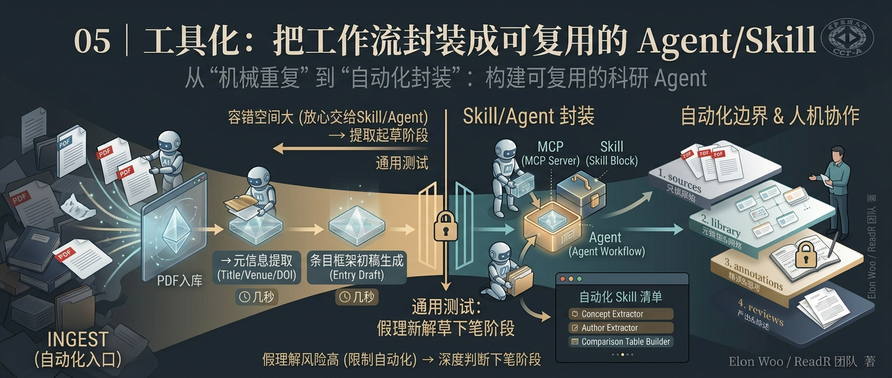

## 你将获得

- 三层自动化工具的全景图：Obsidian 插件层、Claude Code 指令层、NotebookLM CLI 层
- 每一层各自接管工作流的哪个阶段，门槛在哪
- 一份仍然成立的边界清单：三层工具分别在哪一步必须停下来等人确认

## 先纠正一个过时的假设

前四讲讲的都是方法论本身——架构怎么分层、字段怎么设计、AI 的边界在哪、知识怎么沉淀。如果你是从头看下来的，可能会觉得这是一套"讲得通，但还得自己动手全部搭起来"的道理。

这个假设已经不成立了。ReadR 现在有三层是真实存在、可以直接用的自动化，不是"以后可以考虑往这个方向搭"。这一讲要做的不是"论证该不该自动化"，是把这三层分别讲清楚——每一层接管了什么，门槛在哪，以及最关键的：**这三层有没有踩过第三讲那条红线**（会不会在没人发现的情况下把判断也一起自动化了）。

## 第一层：Obsidian 插件生态——把重复操作装进侧边栏

ReadR 打包了 5 个 Obsidian 插件，都在 `.obsidian/plugins/` 目录下,打开 Obsidian 的"设置 → 第三方插件"就能启用:

| 插件 | 用途 | 开箱即用？ |
|---|---|---|
| 📊 ReadR Dashboard | 统计仪表盘：论文分布、阅读进度、知识缺口检测、活动追踪 | 需构建 |
| 📋 Dataview | 元数据查询引擎，仪表盘依赖它做数据聚合 | ✅ 是 |
| 🤖 RealClaudian | Obsidian 内集成 Claude AI，辅助笔记和知识提炼 | ✅ 是 |
| 💻 OTerm | 编辑器内嵌终端，运行脚本和 git 命令 | ✅ 是 |
| 📰 RSS Dashboard | 内嵌 RSS 阅读器，追踪学术论文动态 | ✅ 是 |

四个开箱即用，唯独 ReadR Dashboard 需要多跑两行：

```bash
cd .obsidian/plugins/readr-dashboard/
npm install && npm run build
```

这五个插件对应的其实是工作流里最容易被忽视的一类自动化——**不涉及内容判断,纯粹是操作效率**。RSS Dashboard 订阅 arXiv 和 IEEE 的源，新论文自动推送进 vault，这是 INGEST 阶段"发现新论文"这一步的自动化；OTerm 让你不用切出 Obsidian 就能跑 `pwsh scripts/ReadR.ps1 -Validate` 校验 vault 完整性；Dashboard 把阅读进度和知识缺口可视化，省的你自己数有多少篇论文还卡在 `to-read`。这一层自动化的错误成本很低——统计数字看错了、订阅源重复推送了,都是一眼就能看出来的问题,谈不上"错误被悄悄放大"。

## 第二层：Claude Code——用自然语言驱动四个阶段

ReadR 的 `CLAUDE.md` 已经配置了完整的项目结构和规则,启动 Claude Code 之后会自动加载,不需要每次重新交代"这个项目该怎么运作"。

四个阶段各有对应的典型用法,几乎是直接照抄就能用的指令：

**INGEST 阶段**
```
"根据这篇论文的 PDF 创建条目，使用 library/_template/library-entry.md 模板"
→ Claude 读取 PDF，生成 YAML frontmatter 和摘要
```

**BROWSE 阶段**
```
"从这篇论文中提取核心概念，写入 library/concepts/"
"提取作者信息，写入 library/authors/"
"生成方法对比表格，写入 library/comparisons/"
→ Claude 自动填充对应模板
```

**CLOSE-READ 阶段**
```
"按 annotations/_template/reading-note.md 模板，为这篇论文生成精读笔记初稿"
→ Claude 生成结构化笔记，图/表/公式位置留空待人工补充
```

**REVIEW 阶段**
```
"汇总这个子方向的所有论文，撰写综合概述"
→ Claude 查阅相关条目，生成 synthesis 初稿
```

这一层比插件层多了一个维度：它会真正 touch 内容,不只是统计和展示。所以 `CLAUDE.md` 里明确写死了四条红线,这不是建议,是契约：

- `sources/` 不可修改——Claude 不会碰这个目录里的任何文件
- 所有修改需用户确认——不会未经确认直接写入
- AI 产出是初稿——概念定义、方法对比、精读笔记都需要人工审校
- 图/表/公式必须人工嵌入——AI 处理不了这部分

这四条和第三讲讲的分工原则是同一件事的两种写法：第三讲讲的是"为什么这么分工"，这四条是"这个分工被真的写进了系统提示词，不是靠自觉"。

## 第三层：NotebookLM CLI——REVIEW 阶段的深水区

第三层是 `notebooklm-py`，一个覆盖 NotebookLM 网页版之外能力的命令行工具，主要接管 REVIEW 阶段——生成综述初稿、幻灯片、播客、思维导图等等，命令面板很大。这一层的分量足够写单独一讲，这里只带一句：`notebooklm generate report` 可以直接产出一版综述草稿的 Markdown，剩下的润色和论点由人接手。具体这一层能做到什么程度、边界在哪，下一讲展开。

## 三层自动化的共同边界

回到第三讲那条测试：**错误会不会在后续步骤里被自然发现？** 三层工具对照着看一遍：

- **Obsidian 插件层**：统计和展示类操作，错误容易被肉眼发现，容错空间大
- **Claude Code 层**：契约里写死"AI 产出是初稿"，个人评价、图表公式这类高风险内容强制人工完成
- **NotebookLM 层**：同样明确标注生成内容是草稿——具体边界下一讲细讲

三层没有一层触碰"判断"和"下笔"这两件事。自动化程度越来越深，但红线的位置没有变。

## 小结

自动化已经不是"要不要做"的问题，是"用哪一层、边界画在哪"的问题。Obsidian 插件解决操作效率，Claude Code 解决内容起草，NotebookLM 解决格式转换——三层叠在一起，省下来的时间应该全部流向一件事：你自己的判断和下笔，而不是流向"反正 AI 会兜底"的侥幸。

---

**思考题**：打开你自己的 Obsidian，把 ReadR 的五个插件挨个装一遍，记录哪一步卡住了——大概率是 Dashboard 的构建步骤，如果卡住了，问题出在 Node 环境还是依赖版本？